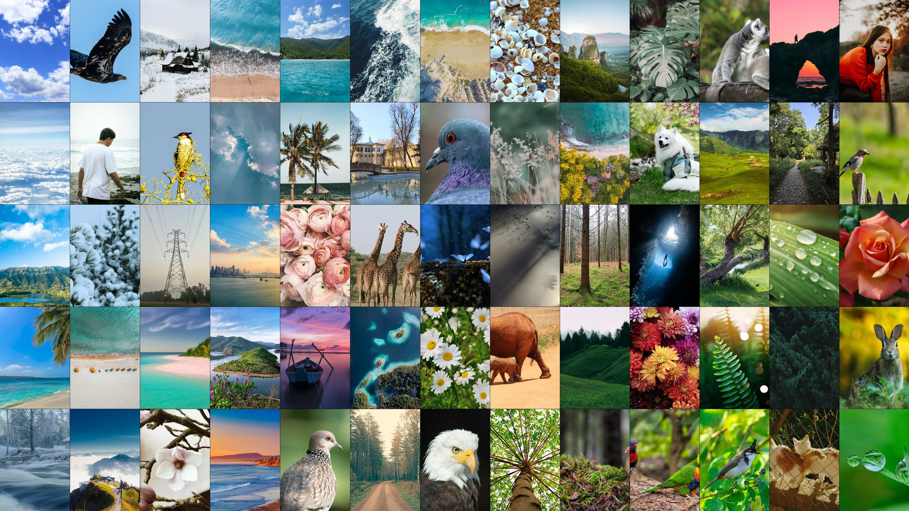
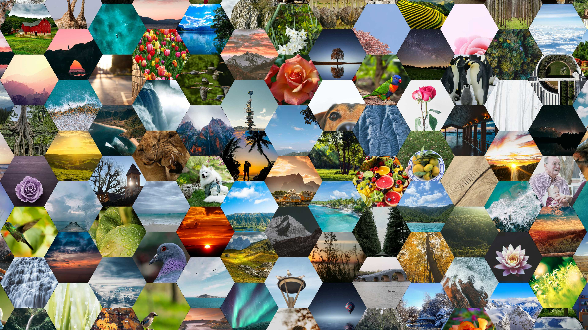
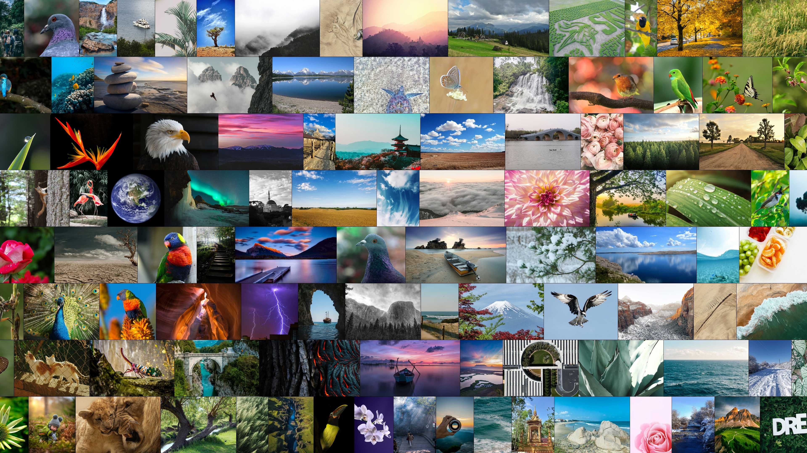
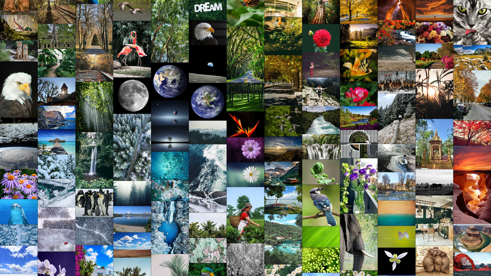

# Kana Wallpaper - Unified FINAL

画像フォルダから複数枚を選び、**grid / hex / mosaic（uniform-height, uniform-width）** などのレイアウトで  
**1枚の壁紙画像（PNG）**を生成します。Windows環境では生成後に壁紙へ設定することもできます。

## これは何？
- 画像をタイル状に並べて、**1枚の壁紙PNG**を生成するツールです。
- 迷ったら **`kana_wallpaper_launcher.py`（ランチャー）** を起動して、質問に答えるだけでOKです。
- 依存関係は `requirements.txt` / `requirements-optional.txt` で管理します（下記参照）。

---

## 目次
- [サンプル出力](#サンプル出力)
- [ファイル構成](#ファイル構成)
- [それぞれの役割](#それぞれの役割)
- [必要環境](#必要環境)
- [インストール](#インストール)
- [使い方（基本）](#使い方基本)
- [よくある挙動（FAQ）](#よくある挙動faq)
- [生成されるファイル（画像以外）と保存場所](#生成されるファイル画像以外と保存場所)
- [利用条件](#利用条件)
- [更新履歴](#更新履歴)

---

## サンプル出力

### grid


<details>
<summary>他のサンプル出力（クリックで表示）</summary>

<p>
  <b>hex</b><br>
  
</p>

<p>
  <b>mosaic-uniform-height</b><br>
  
</p>

<p>
  <b>mosaic-uniform-width</b><br>
  
</p>

</details>

---

## ファイル構成
- 本体（core）: `kana_wallpaper_unified_final.py`
- ランチャー（launcher）: `kana_wallpaper_launcher.py`
- この説明: `README.md`
- 依存関係（必須）: `requirements.txt`
- 依存関係（任意）: `requirements-optional.txt`

既定の入力フォルダは `./images`（存在しない場合はドラッグ＆ドロップ/CLI推奨）です。

---

## それぞれの役割

### 1) `kana_wallpaper_launcher.py`（ランチャー）
コンソール上で質問に答えながら、本体へ設定を渡して実行するためのUIです。

できること（主な項目）：
- レイアウト選択：grid / mosaic-uniform-height / mosaic-uniform-width / hex / random
- 抽出モード：random / aesthetic / recent / oldest / name_asc / name_desc
- 近似重複排除（dHash）やフルシャッフル、ZIP走査のON/OFF
- 並び：グラデーション（diagonal / hilbert）・散らし（scatter）
- 必要な場合のみ、最適化パラメータ（steps / reheats / k）を入力

---

### 2) `kana_wallpaper_unified_final.py`（本体）
壁紙生成の処理を実行するコアです。

#### 入力・選別
- 画像走査（サブフォルダ含む）／ZIP内画像（任意）
- 画像選別（aesthetic / recent / oldest など）
- 近似重複排除（dHash + 永続キャッシュ）

#### レイアウト
- grid：格子配置
- mosaic-uniform-height / mosaic-uniform-width：アスペクト比を保って隙間なく敷き詰め（黒帯なし）
- hex：六角ハニカム配置
- random：候補レイアウトからランダム選択

#### 並び（初期配置）
- spectral / hilbert / diagonal / checkerboard

#### 近傍最適化（任意）
- anneal（焼きなまし：steps / reheats / k）

#### 付加機能（任意）
- face-focus：顔検出の結果を利用してタイルの中心を調整（OpenCVがある場合）
- エフェクト：bloom/halation、sepia、grain、vignette など（設定でON/OFF）

#### キャッシュ・安全対策
- キャッシュ：dHash永続キャッシュ / Lab / aesthetic / face などの再利用（再実行時の高速化）
- ZIP安全：ZIPメンバーのサイズ・圧縮率ガード
- 極端に巨大な画像のスキップ（メモリ急増対策）

---

## 必要環境
- Python 3.9+
- Pillow（必須）
- numpy（任意：spectral/hilbert系の品質向上）
- opencv-python（任意：face-focus を使う場合）

---

## インストール
```bash
pip install -r requirements.txt
# 任意機能も使うなら
pip install -r requirements-optional.txt
```

---

## 使い方（基本）
### ランチャー（推奨）
1. `kana_wallpaper_unified_final.py`（本体）と `kana_wallpaper_launcher.py`（ランチャー）を同じフォルダに置く  
2. `kana_wallpaper_launcher.py` を実行  
3. 質問に答えると壁紙画像を生成します

```bash
python kana_wallpaper_launcher.py
```

---

## よくある挙動（FAQ）
- **Q. Full shuffle（完全ランダム）を ON にすると、グラデ/散らし等が効かない？**  
  A. Full shuffle が優先されるため、グラデ/散らし等の並べ替え（post処理）は基本的に無効化されます。

- **Q. 初回が重い / 2回目以降が速いのはなぜ？**  
  A. 初回は aesthetic/Lab/face などの計算が入り、キャッシュが作られるためです。2回目以降はキャッシュにより高速化されます。

---

## 生成されるファイル（画像以外）と保存場所

### 1) 近似重複キャッシュ（dHash）
- `kana_wallpaper.dhash_cache.json`（または設定した `DHASH_CACHE_FILE` のパス）
  - 近似重複判定（dHash）などのキャッシュです。削除しても再生成されます。
  - **注意**：キャッシュには **画像ファイルのパス**（ZIP内パスを含む）が保存されます。
  - **保存場所**：`DHASH_CACHE_FILE` が指定されていればその場所。未指定の場合は本体の既定ルールで決まります  
    （ランチャー起動時に `cache(dHash): ...` として表示されます）。
  - **無効化**：キャッシュは設定で無効にできます（例：`DHASH_CACHE_ENABLE = False` など）。  
    無効にするとキャッシュファイルは作成・更新されません（代わりに処理が遅くなる場合があります）。

### 2) 使用画像一覧（任意：デフォルトOFF）
- `used_images.csv`
- `used_images.txt`
  - **デフォルトでは生成しません（OFF）**。必要な場合のみ設定で有効化してください。
  - 有効化した場合、直近の実行で使用した画像の一覧を保存します。
  - **注意**：一覧には **画像ファイルのパス**（ZIP内パスを含む）が記録されます。
  - **保存場所**：設定により変わります（ログ保存先/作業フォルダ/一時フォルダなど）。

### 3) その他（設定により作成）
- `meta.json`（生成条件・使用情報などのメタデータ）
  - 保存場所は設定により変わります。

---

## 利用条件
- 改造・カスタマイズは自由です。
- 商用利用はご遠慮ください（収益化を目的とする利用、販売、業務での利用など）
- 動作保証はありません。実行・利用によって生じたいかなる損害についても、作者は責任を負いません。  
  ご自身の責任でご利用ください（心配な場合は事前にバックアップ推奨です）

---

## 更新履歴
2026-01-09
- 公開
