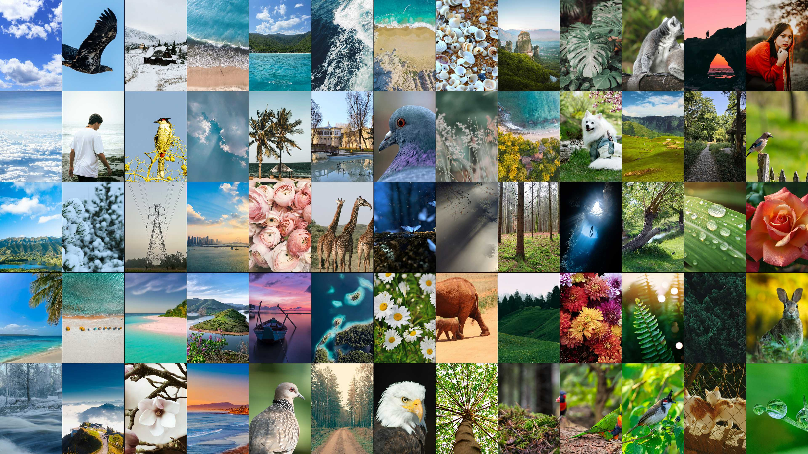
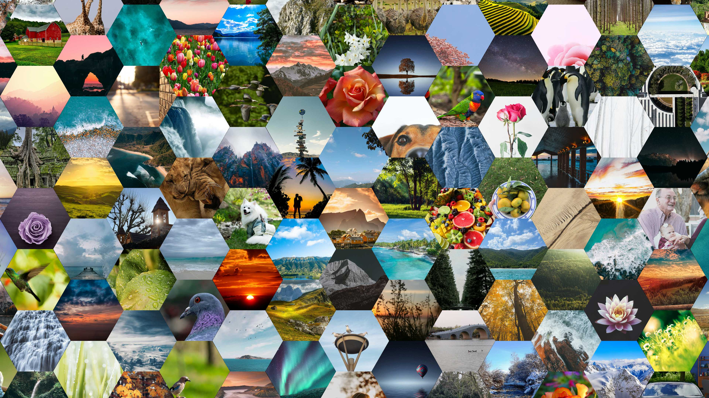
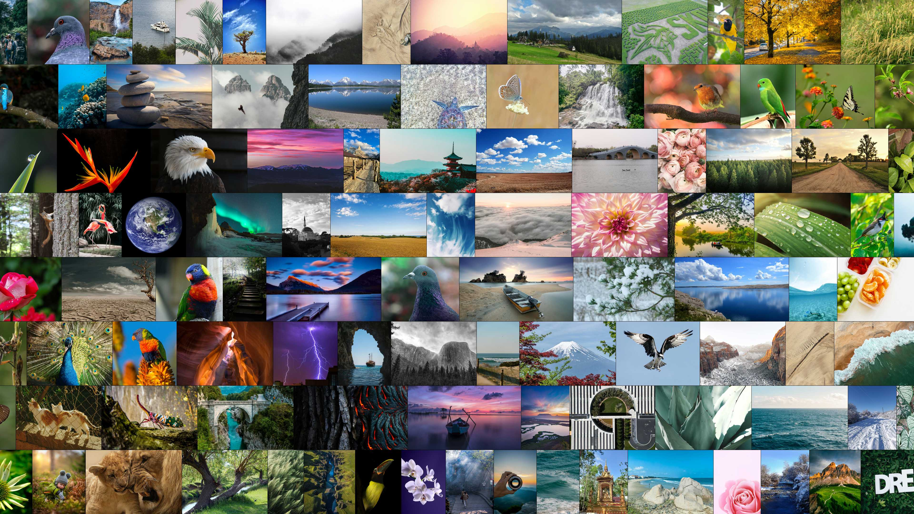
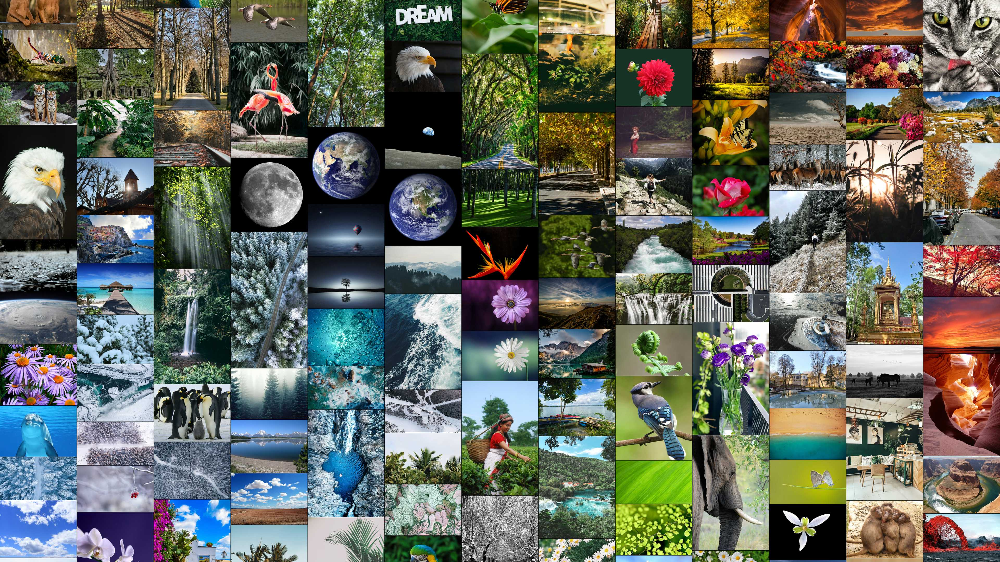
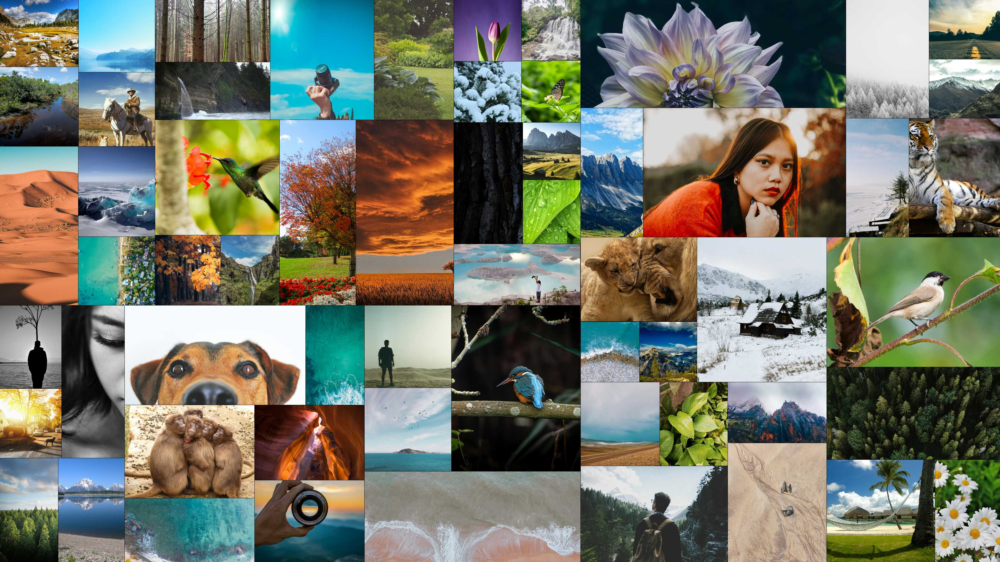
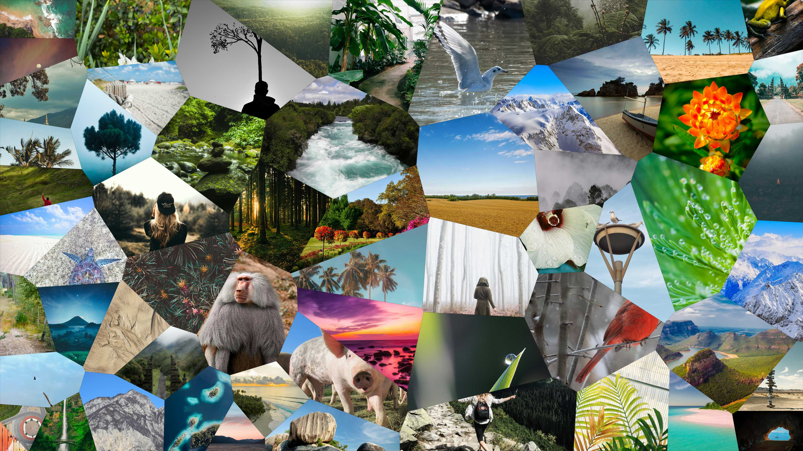

# Kana Wallpaper - Unified FINAL

画像フォルダ / アーカイブ / 動画（フレーム抽出）から複数枚を集め、**grid / hex / mosaic（uniform-height, uniform-width）/ quilt / stained-glass** などのレイアウトで  
**1枚の壁紙画像（PNG/JPG）**を生成します。Windows環境では必要なら生成後に壁紙へ設定することもできます。

---

## これは何？
- 画像をタイル状に並べて、**1枚の壁紙画像**を生成するツールです。
- 迷ったら **ランチャー（launcher）** を起動して、質問に答えるだけでOKです。

---

## 目次
- [サンプル出力](#サンプル出力)
- [ファイル構成](#ファイル構成)
- [クイックスタート](#クイックスタート)
- [主な機能](#主な機能)
- [必要環境](#必要環境)
- [インストール](#インストール)
- [使い方（基本）](#使い方基本)
- [AI顔検出（任意）](#ai顔検出任意)
- [動画フレーム抽出（任意）](#動画フレーム抽出任意)
- [生成されるファイル（画像以外）と保存場所](#生成されるファイル画像以外と保存場所)
- [利用条件](#利用条件)
- [更新履歴](#更新履歴)

---

## サンプル出力

### grid


<details>
<summary>他のサンプル出力（クリックで表示）</summary>

<p>
  <b>hex</b><br>
  
</p>

<p>
  <b>mosaic-uniform-height</b><br>
  
</p>

<p>
  <b>mosaic-uniform-width</b><br>
  
</p>

<p>
  <b>quilt</b><br>
  
</p>

<p>
  <b>stained-glass</b><br>
  
</p>

</details>

---
## ファイル構成

### スクリプト
- 本体（core）: `kana_wallpaper_unified_final.py`
- ランチャー（launcher）: `kana_wallpaper_launcher.py`
- ワンクリック実行（Windows）: `RUN_KANA_WALLPAPER_ONECLICK.bat`
- ワンクリック環境セットアップ: `kana_wallpaper_env_setup.py`
- この説明: `README.md`

### 依存関係
- 依存関係（必須）: `requirements.txt`
- 依存関係（任意）: `requirements-optional.txt`

### 生成物・設定・キャッシュ（自動生成）
- `_kana_state/`（既定の出力先。存在しなければ自動作成）
  - `models/`（AIモデル置き場）
  - `kana_wallpaper_presets.json` / `kana_wallpaper_last_run.json` など

---

## クイックスタート

### 1) 依存関係を入れる
```bash
pip install -r requirements.txt
# 任意機能も使うなら（必要に応じて）
pip install -r requirements-optional.txt
```

### 2) ランチャーを起動（推奨）
```bash
python kana_wallpaper_launcher.py
```


---

## ワンクリックGPUセットアップ（Windows推奨）

重い処理（AI顔検出・stained-glassのfacefit等）を **GPU（YOLO）** で動かしやすくするため、
このリポジトリには **ワンクリック実行** 用の2ファイルを同梱します。

- `RUN_KANA_WALLPAPER_ONECLICK.bat`（ダブルクリック用）
- `kana_wallpaper_env_setup.py`（venv作成・依存インストール・モデルDL）

### 使い方（いちばん簡単）
1. Windowsで `RUN_KANA_WALLPAPER_ONECLICK.bat` を **ダブルクリック**
2. 初回のみ、自動で以下を行います：
   - `.venv/` を作成して依存をインストール（Pillow / numpy / OpenCV / ultralytics など）
   - GPUを自動判定して PyTorch を導入（NVIDIAが見つかればCUDA版、無ければCPU版）
   - `_kana_state/models/` にモデルを揃える（不足していれば自動DL）
     - YuNet / AnimeFace cascade
     - YOLO重み（`yolov8x6_animeface.pt`：大きめ）

※`RUN_KANA_WALLPAPER_ONECLICK.bat` は、`_kana_state/models/` に不足しているモデルがあれば **自動でダウンロード**します（YOLO重みも含む）。
3. セットアップ後 `kana_wallpaper_launcher.py` を `.venv` のPythonで起動します。

### 手動で実行したい場合
```bash
python kana_wallpaper_env_setup.py --download-models --download-yolo

（※ONECLICK.bat から実行する場合は、不足しているモデルを自動判定して必要なDLフラグを付けます）
```

オプション例：
- `--gpu cuda|cpu|directml|auto`（既定はauto）
- `--download-models`（YuNet + AnimeFace）
- `--download-yolo`（YOLO重み：大きいファイル。手動実行時に明示したい場合）

> 注意：モデルやキャッシュは `_kana_state/` に作られます。公開リポジトリへコミットしないでください。

---

## 主な機能

### 入力ソース
- フォルダ（サブフォルダ走査対応）
- アーカイブ（zip/7z/rar：環境・設定による）
- 動画（フレーム抽出：ffmpeg/ffprobe を使う）

### レイアウト
- grid：格子配置
- mosaic-uniform-height / mosaic-uniform-width：アスペクト比を保って敷き詰め
- hex：六角ハニカム配置
- quilt：矩形パネルを分割・合体しながら作る「布団（キルト）」風
- stained-glass：ステンドグラス風（境界線/ピース/ワープ等）
- random：候補レイアウトからランダム選択

### 並び（初期配置）・最適化（任意）
- 並び：spectral / hilbert / diagonal / checkerboard など
- 最適化：anneal（焼きなまし）など

### 顔フォーカス（任意）
- ヒューリスティック（軽量）
- AI（YOLO/YuNet/AnimeFace）  
  ※YOLOはGPU対応（PyTorch環境が必要）

### エフェクト（任意）
- 光（bloom/halation 等）
- 色味（grading/LUT 等）
- ディテール（sharpen/NR 等）
- 仕上げ（grain/vignette 等）
- 明るさ（auto/hybrid 等）

---

## 必要環境
- Python 3.9+
- Pillow（必須）
- numpy（必須）

任意：
- opencv-python（顔検出/一部機能）
- ultralytics（YOLOを使う場合。PyTorchが別途必要）
- py7zr / rarfile（7z/rar を Python 側で扱いたい場合）
- ffmpeg / ffprobe（動画フレーム抽出）

---

## インストール
```bash
pip install -r requirements.txt
# 任意機能も使うなら
pip install -r requirements-optional.txt
```

---

## 使い方（基本）

### ランチャー（推奨）
1. core と launcher を同じフォルダに置く  
2. ランチャーを起動  
3. 質問に答えると壁紙画像を生成します

※ダブルクリック起動時の既定探索先は `./AI_images`（Windows: `.\AI_images`）です。フォルダが無い場合はドラッグ＆ドロップ/CLI推奨。

### core（CLI）
```bash
py -3 kana_wallpaper_unified_final.py .\AI_images
```

---

## AI顔検出（任意）

### モデル置き場（既定）
AIモデルは既定で **`_kana_state/models/`** に置きます（無ければ自動作成）。

例：
- YOLO: `yolov8x6_animeface.pt`
- YuNet: `face_detection_yunet_2023mar.onnx`
- AnimeFace: `lbpcascade_animeface.xml`

### YOLO（GPU）について
YOLOをGPUで使うには、PyTorchをGPU版で入れる必要があります（環境により手順が変わるため、PyTorch公式の手順に従ってください）。  
その後に `requirements-optional_FULL_no_torch.txt` を入れるのがおすすめです。

---

## 動画フレーム抽出（任意）

- 動画からフレームを抽出して、通常の画像と同様にレイアウトに混ぜられます。
- 抽出方式は `random / uniform / scene / scene_best / best_*` などを選べます（ランチャーから設定可能）。
- ffmpeg / ffprobe が必要です（PATHに入れるか、設定でパス指定）。

動画フレームのキャッシュは既定で `_kana_state/kana_wallpaper_video_frames_cache/` に作られます。

---

## 生成されるファイル（画像以外）と保存場所

既定の保存場所は **`_kana_state/`** です。

### 1) 近似重複キャッシュ（dHash）
- `kana_wallpaper.dhash_cache.json`  
  - 近似重複判定（dHash）などのキャッシュです。削除しても再生成されます。
  - **注意**：キャッシュには **画像ファイルのパス**（ZIP内パスを含む）が保存されます。

### 2) 使用画像一覧 / メタ（既定ON）
- `kana_wallpaper_used_images.csv`
- `kana_wallpaper_used_images.txt`
- `kana_wallpaper_meta.json`
  - 直近の実行で使用した画像の一覧・条件などを保存します。
  - **注意**：これらには **画像ファイルのパス**（ZIP内パスを含む）が記録される場合があります。公開リポジトリへコミットしないでください。

### 3) ランチャーの設定・エクスポート
- `kana_wallpaper_presets.json`（プリセット）
- `kana_wallpaper_last_run.json`（前回設定）
- `kana_wallpaper_launcher_export.json`（ランチャー→core 連携用）

### 4) 連続出力フォルダ
- `continuous_YYYYmmdd_HHMMSS/`  
  - 連続出力時に作られ、生成画像をまとめて保存します。

## 利用条件
- 改造・カスタマイズは自由です。
- 商用利用はご遠慮ください（収益化を目的とする利用、販売、業務での利用など）。
- 動作保証はありません。実行・利用によって生じたいかなる損害についても、作者は責任を負いません。  
  ご自身の責任でご利用ください（心配な場合は事前にバックアップ推奨です）。

---

## 更新履歴
2026-03-02
- `_kana_state/` 集約（出力・キャッシュ・プリセット・AIモデル）
- quilt / stained-glass / 動画フレーム抽出 / AI顔検出（YOLO/YuNet/AnimeFace）などを反映
- requirements整理

2026-01-13
- マルチスレッドを導入し高速化
- 安定性・微修正：落ちやすい箇所の修正

2026-01-09
- 公開
